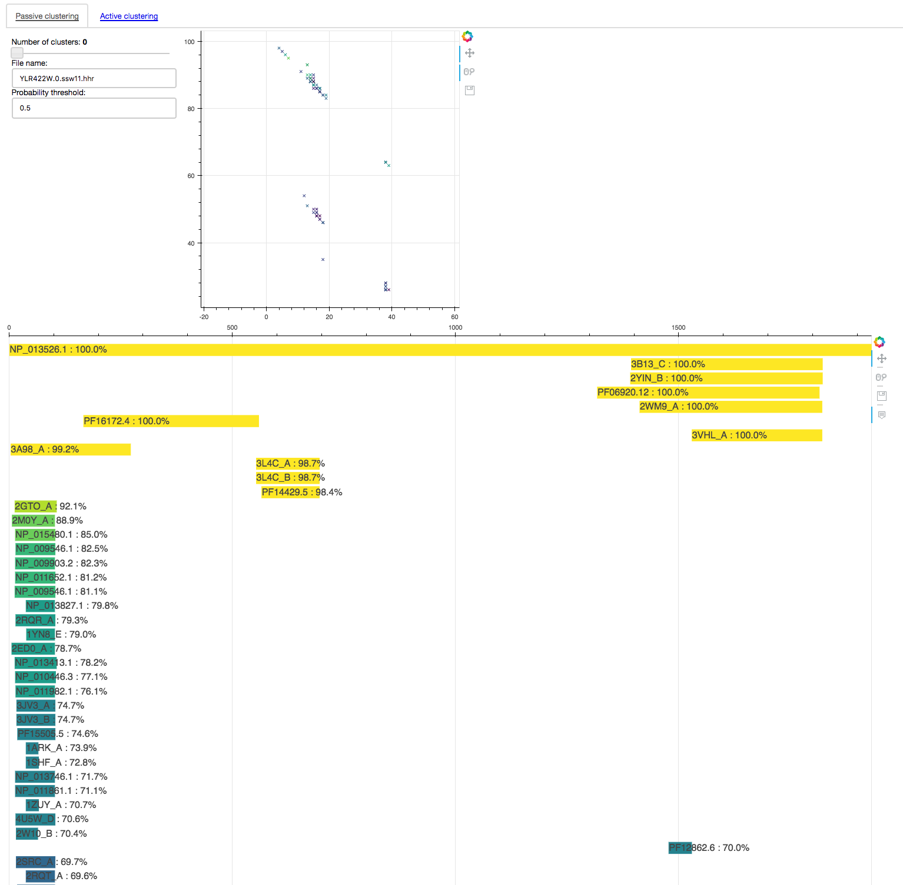

# HHyeast-server
This is a dumb-down version of https://github.com/UCL/HHyeast-server. It has been modified so it takes a little less time to build.

We are using it as a test research webapp on CloudLabs. It is deployed using Terraform and a provisioning script which clones the repo, builds a docker image and runs it. You can see more on the Terraform file in this repo:

https://github.com/UCL-CloudLabs/deployer


## Run locally
To install package: `pip install -r requirements.txt`

To run the server locally: `bokeh serve --show lolliplotServer.py`

You can access it in http://0.0.0.0:5006 and plot some cool stuff by entering `YLR422W.0.ssw11.hhr` on the `File Name` field. You should see something like this:



## Run locally on docker
Make sure you have Docker installed and the Docker deamon is up and running.

Then:

```bash
docker build -t mywebapp .
docker run -d -e AZURE_URL=0.0.0.0 -p 5006:5006 mywebapp
```

You should be able to access the website and load data in the same way as indicated above.
